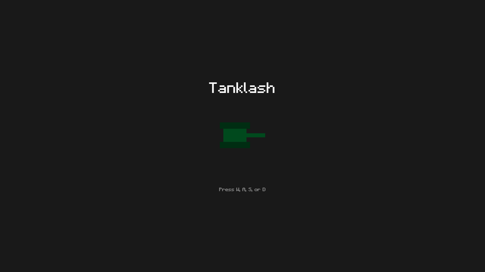
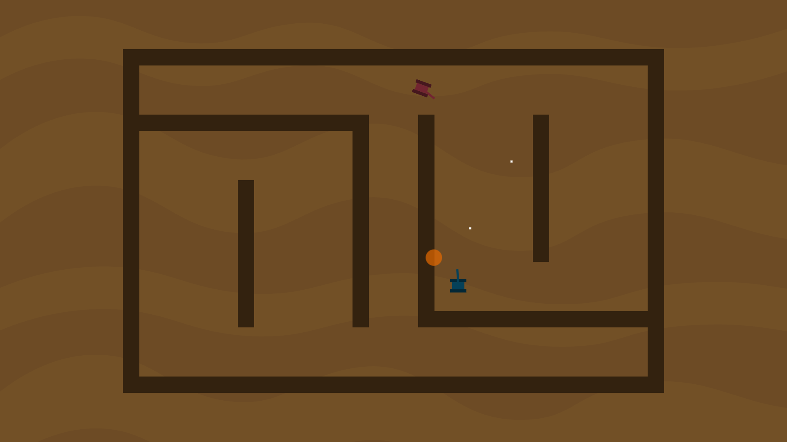

# Tanklash

## Play

https://tanklash.herokuapp.com (If you are the only user, it will take a while to load at first. It's a free Heroku deployment.)

## Introduction

Pick a tank color and destroy your friends! Inspired by the Nintendo Wii game "Tanks!", Tanklash features the classic bouncing bullets with a PVP gameplay. Join a lobby with up to 6 players in total, choose a map, and demolish the other tanks. It's free to play on the browser.

## Technologies

###### Frontend:
* HTML
* CSS
* JavaScript

###### Backend:
* [Node](https://nodejs.org/en/)
* [Express](https://www.npmjs.com/package/express)
* [WS](https://www.npmjs.com/package/ws)

## Possible Future Development

* Accounts
* Custom Maps
